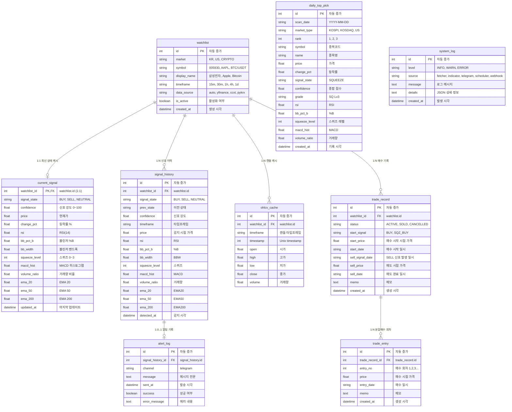

# UBB Pro Signal System — ERD

## 엔티티 관계 다이어그램



## 테이블 관계 요약

| 관계 | 카디널리티 | 설명 |
|------|-----------|------|
| `watchlist` → `current_signal` | 1:1 | 종목별 최신 신호 상태 (대시보드 빠른 조회용) |
| `watchlist` → `signal_history` | 1:N | 모든 신호 전환 이력 |
| `watchlist` → `ohlcv_cache` | 1:N | 차트 렌더링용 캔들 데이터 캐시 |
| `watchlist` → `trade_record` | 1:N | 종목별 매수 기록 (ACTIVE는 최대 1개) |
| `trade_record` → `trade_entry` | 1:N | 매수 기록별 분할매수 회차 |
| `signal_history` → `alert_log` | 1:0..1 | 신호 전환 시 텔레그램 발송 기록 |
| `daily_top_pick` | 독립 | 일일 시장 스캔 Top 종목 (코스피/코스닥/미국) |
| `system_log` | 독립 | 시스템 운영 이벤트 로그 |

## CASCADE 삭제

```
watchlist 삭제 시:
  → current_signal   CASCADE
  → signal_history   CASCADE
    → alert_log      CASCADE (signal_history 경유)
  → ohlcv_cache      CASCADE
  → trade_record     CASCADE
    → trade_entry    CASCADE (trade_record 경유)
```

## 인덱스

| 테이블 | 인덱스 | 용도 |
|--------|--------|------|
| `watchlist` | UNIQUE(market, symbol) | 중복 종목 방지 |
| `signal_history` | (watchlist_id, detected_at DESC) | 종목별 최신 이력 |
| `ohlcv_cache` | UNIQUE(watchlist_id, timeframe, timestamp) | 캔들 UPSERT |
| `alert_log` | (sent_at DESC) | 최근 발송 이력 |
| `system_log` | (level, created_at DESC) | 레벨별 로그 |
| `daily_top_pick` | (scan_date, market_type) | 날짜별 추천 조회 |
| `trade_record` | (watchlist_id, status) | 종목별 활성 매수 기록 조회 |
