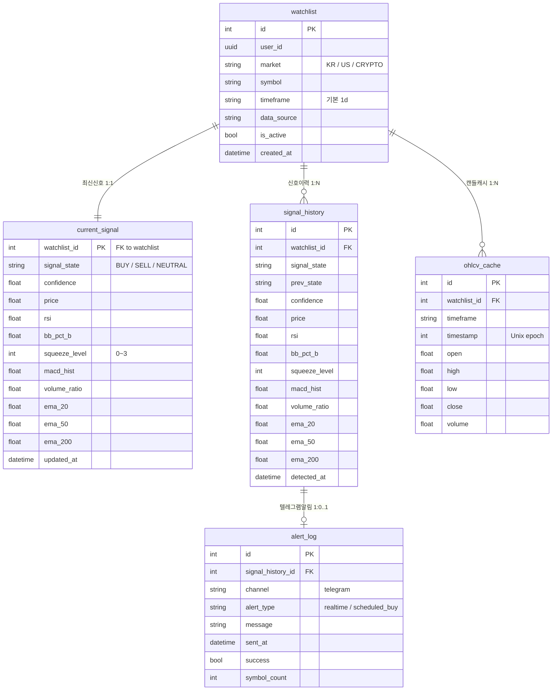
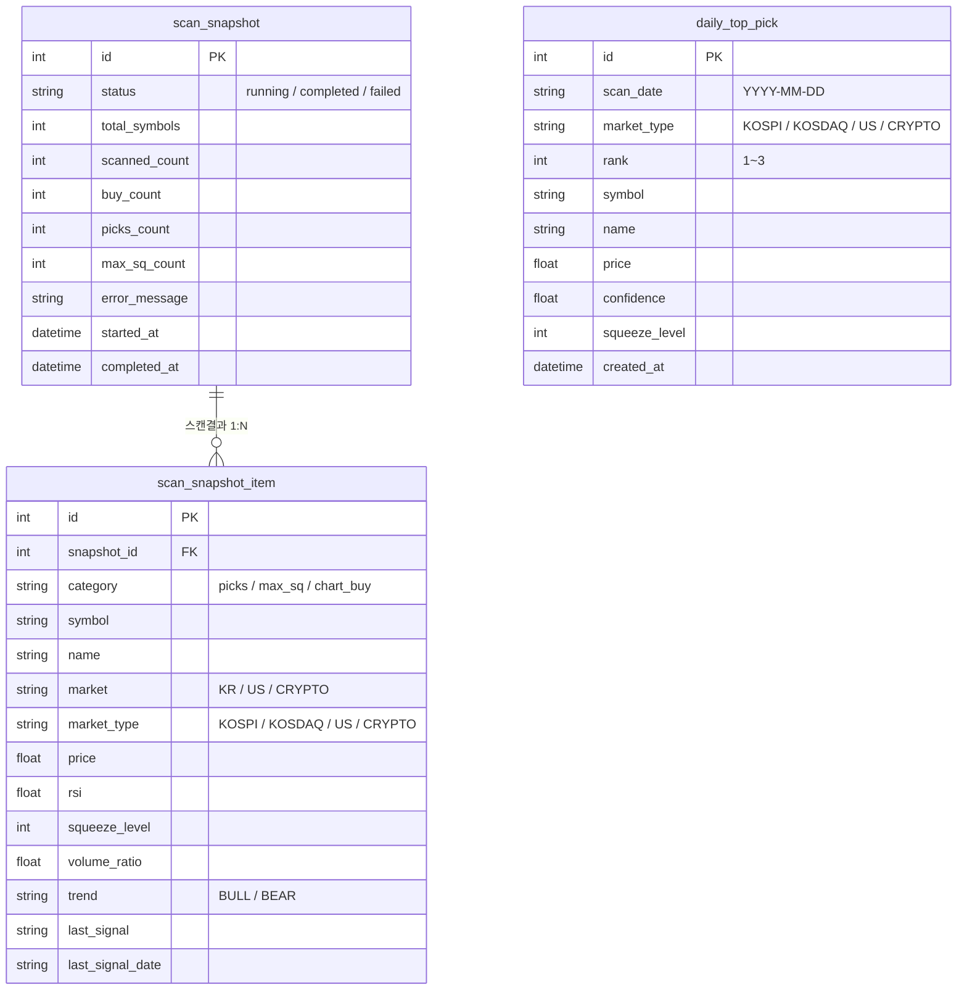
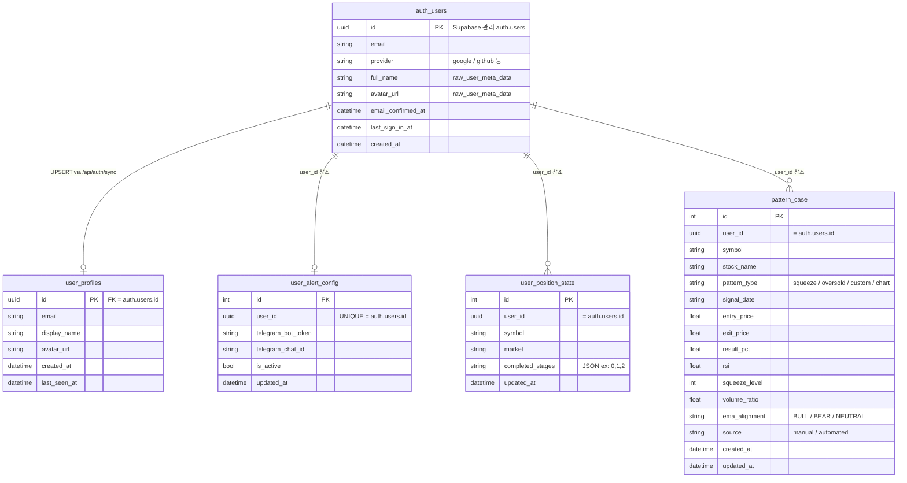
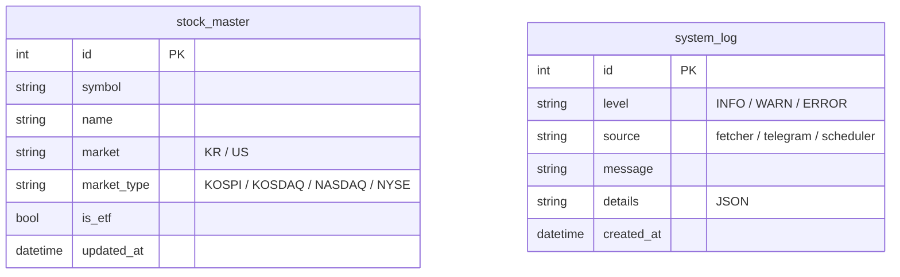

# Supabase ERD 분석 자료

> 작성일: 2026-04-05
> 기반: 실제 소스코드 (`backend/models.py`, `backend/alembic/versions/`, `frontend/src/`)

---

## ERD 다이어그램

도메인별로 분리해서 표시합니다.

---

### 도메인 1 — 핵심 신호 (Signal)

> watchlist 를 중심으로 신호 감지·이력·알림·캔들 캐시가 수직으로 연결됩니다.



---

### 도메인 2 — 전체 시장 스캔 (Scan)

> 스캔 실행 단위(snapshot) → 결과 종목(item) 수직 구조 + 일일 추천(top_pick) 독립



---

### 도메인 3 — 사용자 (User)

> `auth.users` (Supabase 내장) 가 최상위. 로그인 시 `/api/auth/sync` 를 통해 `user_profiles` 에 미러링됩니다.
> 나머지 테이블은 모두 동일한 UUID(`user_id`)로 격리됩니다.



---

### 도메인 4 — 참조·시스템 (Reference)

> FK 없는 독립 테이블. 백엔드 전용.



---

## 1. 테이블 역할과 컬럼 상세

### 핵심 신호 도메인 (4개)

#### `watchlist` — 사용자 추적 종목 목록
| 컬럼 | 타입 | 설명 |
|------|------|------|
| id | int PK | 자동증가 |
| user_id | uuid | Supabase auth.users 참조, nullable |
| market | varchar(10) | KR / US / CRYPTO |
| symbol | varchar(20) | 005930, AAPL, BTC/USDT |
| display_name | varchar(100) | 삼성전자, Apple (nullable) |
| timeframe | varchar(5) | 기본 1d (15m·30m·1h·4h·1d·1w) |
| data_source | varchar(20) | auto / yfinance / ccxt / pykrx |
| is_active | bool | 활성 여부 |
| created_at | datetime | |

> UniqueConstraint: `(market, symbol)` — 전체 시스템에서 종목 중복 불가

#### `current_signal` — 종목별 최신 신호 캐시 (1:1)
| 컬럼 | 타입 | 설명 |
|------|------|------|
| watchlist_id | int PK/FK | watchlist 참조, CASCADE |
| signal_state | varchar(10) | BUY / SELL / NEUTRAL |
| confidence | float | 신호 강도 0~100 |
| price | float | 신호 감지 시점 가격 |
| change_pct | float | 등락률 % |
| rsi / bb_pct_b / bb_width | float | 보조지표 스냅샷 |
| squeeze_level | int | 0~3 (밴드 수축 강도) |
| macd_hist / volume_ratio | float | |
| ema_20 / ema_50 / ema_200 | float | |
| updated_at | datetime | auto-update |

#### `signal_history` — 모든 신호 전환 이력
current_signal과 동일한 지표 컬럼 + `prev_state`(이전 상태), `detected_at` 추가.
인덱스: `(watchlist_id, detected_at DESC)`

#### `alert_log` — 텔레그램 발송 기록
| 컬럼 | 타입 | 설명 |
|------|------|------|
| signal_history_id | int FK | signal_history 참조 |
| channel | varchar(20) | telegram |
| alert_type | varchar(20) | realtime / scheduled_buy |
| message | text | 발송된 메시지 원문 |
| sent_at | datetime | |
| success | bool | 발송 성공 여부 |
| symbol_count | int | 일괄 발송 시 종목 수 |

---

### 전체 시장 스캔 도메인 (3개)

#### `scan_snapshot` — 전체 시장 스캔 실행 단위
스캔 1회 실행 = 레코드 1건. `status` 컬럼으로 진행상태 추적.

#### `scan_snapshot_item` — 스캔 결과 종목별 상세
| category | 내용 |
|----------|------|
| `picks` | 추천종목 (스퀴즈 + 점수 상위) |
| `max_sq` | 투자과열 종목 (RSI ≥ 70 or RSI ≥ 65 + vol ≥ 2x) |
| `chart_buy` | 차트 BUY 신호 종목 |

인덱스: `(snapshot_id, market_type, category)`

#### `daily_top_pick` — 일일 시장별 TOP 3 종목
market_type × rank(1~3) 조합. user_id 없음 → 전체 사용자 공유 데이터.

---

### 사용자 도메인 (auth.users + 4개)

#### `auth.users` — Supabase 내장 인증 테이블 ⚠️ 직접 수정 불가

Supabase가 완전히 관리하는 테이블. Dashboard의 **Authentication → Users** 탭에서만 확인 가능하며, 일반 Table Editor에는 표시되지 않음.

| 컬럼 | 타입 | 설명 |
|------|------|------|
| id | uuid PK | 전체 시스템에서 사용하는 user_id의 실체 |
| email | text | 구글 계정 이메일 |
| role | text | authenticated (기본값) |
| raw_app_meta_data | jsonb | `{ "provider": "google", "providers": ["google"] }` |
| raw_user_meta_data | jsonb | `{ "full_name": "...", "avatar_url": "...", "email": "..." }` |
| email_confirmed_at | timestamptz | 이메일 인증 완료 시각 |
| last_sign_in_at | timestamptz | 마지막 로그인 시각 |
| created_at | timestamptz | 최초 가입 시각 |
| updated_at | timestamptz | |

**Google OAuth 로그인 흐름:**
```
1. supabase.auth.signInWithOAuth({ provider: 'google' })
       ↓
2. Google 인증 완료 → auth.users 에 자동 UPSERT (Supabase 처리)
       ↓
3. AuthProvider.tsx → syncUser(access_token) 호출
       ↓
4. POST /api/auth/sync  →  user_profiles 에 UPSERT
       ↓
5. 이후 모든 API 요청: Authorization: Bearer {JWT}
   백엔드에서 JWT의 sub 클레임 = auth.users.id 를 user_id로 사용
```

> `user_profiles`가 0개인 경우: auth.users 에는 계정이 있지만 `/api/auth/sync` 가 실패한 것. 백엔드 실행 중에 재로그인하면 자동 생성됨.

#### `user_profiles` — auth.users 공개 정보 미러
로그인 시 `/api/auth/sync` POST에서 UPSERT. 직접 조회는 없음.

#### `user_alert_config` — 사용자별 텔레그램 봇 설정
user_id UNIQUE → 사용자당 1개 설정. 텔레그램 토큰/채팅ID 저장.

#### `user_position_state` — 포지션 가이드 매수 단계 진행 상태
UniqueConstraint: `(user_id, symbol, market)`.
`completed_stages`: JSONB 배열 `[0, 1, 2]` → 완료한 매수 단계.
localStorage와 서버 양쪽에 동기화 (기기 간 공유).

#### `pattern_case` — BUY 신호 우수사례 스크랩북
사용자가 직접 저장하는 패턴 케이스. 신호 시점의 지표 스냅샷 보존.
`source`: manual(사용자입력) / automated(자동수집).

---

### 참조/시스템 테이블 (2개)

#### `stock_master` — 전종목 검색 마스터 (한투 FTP)
3,700+ 국내 종목 + 미국 종목. 검색(`/api/search?q=`) 용도로만 사용.

#### `system_log` — 백엔드 운영 이벤트 로그
프론트엔드 접근 없음. source별 인덱스로 빠른 조회.

---

## 2. 테이블 관계 요약

| 관계 | 설명 |
|------|------|
| watchlist → current_signal | 1:1, PK=FK, CASCADE |
| watchlist → signal_history | 1:N, CASCADE |
| watchlist → ohlcv_cache | 1:N, CASCADE |
| signal_history → alert_log | 1:0..1, CASCADE |
| scan_snapshot → scan_snapshot_item | 1:N, CASCADE |
| user_profiles ← auth.users | UUID 동기화 (UPSERT) |
| user_alert_config | user_id UNIQUE, 독립 |
| user_position_state | (user_id, symbol, market) UNIQUE, 독립 |
| pattern_case | user_id 필터, 독립 |
| daily_top_pick | 독립 (연관 FK 없음) |
| stock_master | 독립 (연관 FK 없음) |
| system_log | 독립 |

---

## 3. 레코드 적재량 추정

| 테이블 | 레코드 증가 주기 | 예상 규모 |
|--------|----------------|-----------|
| watchlist | 사용자가 종목 추가 시 | 사용자당 5~50건 |
| current_signal | watchlist와 동일 (1:1) | watchlist 수와 동일 |
| signal_history | 신호 전환 발생 시 | 종목당 일 1~3건 (신호 변화 있을 때) |
| alert_log | 텔레그램 발송 시 | 일 4~6건 (스케줄 발송 기준) |
| ohlcv_cache | 스캐너 실행 시 | 종목당 타임프레임별 ~288캔들 (1d×12개월) |
| scan_snapshot | 전체 스캔 1회 실행 시 | 일 2회 (19:50, 03:50) + 수동 |
| scan_snapshot_item | scan_snapshot 완료 시 | 스냅샷당 50~200건 |
| daily_top_pick | 일일 스캔 완료 시 | 일 9건 (시장 3종 × TOP 3) |
| stock_master | 한투 마스터 갱신 시 | 고정 3,700+ 건 |
| user_profiles | 로그인 시 UPSERT | 사용자 수와 동일 |
| user_alert_config | 설정 저장 시 | 사용자당 1건 |
| user_position_state | 포지션 가이드 사용 시 | 사용자 × 보유종목 수 |
| pattern_case | 사용자 스크랩 시 | 사용자당 10~50건 |
| system_log | 백엔드 이벤트 발생 시 | 일 수백~수천 건 |

---

## 4. Supabase를 사용하지 않는 테이블

프론트엔드에서 Supabase JS SDK로 **직접 쿼리하지 않는** 테이블 (모두 FastAPI 백엔드를 통해서만 접근):

> 이 프로젝트의 모든 테이블은 Supabase SDK로 직접 쿼리하지 않습니다.
> 프론트엔드는 Supabase를 **인증(Auth)** 용도로만 사용하고, 데이터는 전부 FastAPI `/api/*` 를 통해 접근합니다.

그 중에서도 **프론트엔드 자체가 전혀 쿼리하지 않는** 테이블 (백엔드 전용):

| 테이블 | 사용 주체 | 이유 |
|--------|----------|------|
| `signal_history` | 백엔드 스캐너 | 신호 전환 이력 자동 기록, 프론트 직접 조회 없음 |
| `stock_master` | 백엔드 검색 API | `/api/search` 내부에서만 사용 |
| `user_profiles` | 백엔드 auth sync | 로그인 시 `/api/auth/sync` UPSERT, 이후 조회 없음 |
| `system_log` | 백엔드 로깅 | 운영 로그, 관리자 전용 |
| `ohlcv_cache` | 백엔드 fetcher | 프론트는 `/api/chart/*` 결과만 수신 |

---

## 5. 브라우저에서 Supabase DB 없이 사용하는 데이터

### 5-1. Zustand 인메모리 스토어

| 스토어 | 파일 | 저장 데이터 | 유지 기간 |
|--------|------|-----------|---------|
| `useScanStore` | `stores/scanStore.ts` | buyItems, overheatItems, picks | 세션 (3분 stale) |
| `useAuthStore` | `stores/authStore.ts` | user 객체 | localStorage 영속 |
| (Toast) | 내부 | 알림 메시지 | 수초 후 소멸 |

**useScanStore 상세:**
```typescript
// 3분 이내 재진입 시 API 재호출 없이 캐시 반환
const STALE_MS = 3 * 60 * 1000

// Dashboard + Scan 두 페이지가 공유 — 중복 fetch 방지
await loadScanData()  // loaded && (now - lastFetchedAt < STALE_MS) 이면 skip
```

### 5-2. localStorage 영속 데이터

| localStorage 키 | 저장 내용 | 설정 위치 | 서버 동기화 |
|----------------|---------|---------|-----------|
| `auth-storage` | `{ user: User }` Zustand persist | authStore.ts | ❌ 클라이언트 전용 |
| `dash_showPicks` | 추천종목 섹션 펼침 여부 (`true`/`false`) | Dashboard.tsx | ❌ |
| `dash_showOverheat` | 투자과열 섹션 펼침 여부 | Dashboard.tsx | ❌ |
| `buyPoints:{symbol}` | 차트 수동 BUY 마커 `{price, date, markerTime}` | hooks/useBuyPoint.ts | ❌ |
| `posGuide:{symbol}` | 포지션 가이드 완료 단계 `{signalDate, completedStages}` | PositionGuide.tsx | ✅ `/api/position/{symbol}` 과 동기화 |

> `posGuide:{symbol}` 는 예외적으로 서버(`user_position_state`) 와 양방향 동기화됩니다.
> 로그인 상태면 서버 → localStorage, 변경 시 localStorage → 서버로 sync.

### 5-3. Supabase Auth 관련 브라우저 저장

Supabase SDK가 자동 관리 (직접 접근 불필요):

| 저장소 | 키 | 내용 |
|--------|-----|------|
| localStorage | `sb-*-auth-token` | access_token + refresh_token (JWT) |
| 메모리 | session 객체 | 현재 세션, 만료 시 refresh_token으로 갱신 |

---

## 6. 전체 데이터 흐름 구조

```
┌─────────────────── 브라우저 ──────────────────────────────────────┐
│                                                                    │
│  Supabase JS SDK                                                   │
│  ├─ supabase.auth.signInWithOAuth()  →  Google OAuth              │
│  ├─ supabase.auth.getSession()       →  JWT 추출                  │
│  └─ supabase.auth.signOut()                                       │
│                                                                    │
│  axios interceptor: Authorization: Bearer {access_token}          │
│       ↓                                                            │
│  FastAPI /api/*     ←────────────────────────────────────────┐    │
│                                                               │    │
│  Zustand (인메모리)                                           │    │
│  ├─ useScanStore   buyItems / overheatItems / picks           │    │
│  └─ useAuthStore   user 객체 (localStorage persist)           │    │
│                                                               │    │
│  localStorage                                                 │    │
│  ├─ auth-storage     user 객체                                │    │
│  ├─ dash_show*       UI 토글 상태                             │    │
│  ├─ buyPoints:*      차트 수동 마커                           │    │
│  └─ posGuide:*       포지션 가이드 ──────────────────────────┘    │
│       (양방향 sync: /api/position/{symbol})                        │
│                                                                    │
└────────────────────────────────────────────────────────────────────┘
                              │
                              ▼
┌─────────────────── FastAPI 백엔드 ─────────────────────────────────┐
│                                                                    │
│  auth.py: JWT 검증 (Supabase JWKS)                                │
│  → user_id (sub claim) 추출                                        │
│  → 모든 DB 쿼리에 WHERE user_id = ? 적용                          │
│                                                                    │
│  Routes:                                                           │
│  /watchlist        → watchlist (user-scoped)                      │
│  /signals          → current_signal + watchlist (user-scoped)     │
│  /scan/full/*      → scan_snapshot + item (공유)                  │
│  /scan/market/*    → daily_top_pick (공유)                        │
│  /pattern-cases    → pattern_case (user-scoped)                   │
│  /settings/telegram → user_alert_config (user-scoped)            │
│  /position/{sym}   → user_position_state (user-scoped)           │
│  /alerts/history   → alert_log (공유)                             │
│  /search?q=        → stock_master (공유, 읽기 전용)               │
│                                                                    │
└────────────────────────────────────────────────────────────────────┘
                              │
                              ▼
┌─────────────────── Supabase PostgreSQL ────────────────────────────┐
│                                                                    │
│  사용자 격리 테이블 (user_id 필터)                                 │
│  ├─ watchlist, current_signal, signal_history, ohlcv_cache        │
│  ├─ user_profiles, user_alert_config, user_position_state         │
│  └─ pattern_case                                                  │
│                                                                    │
│  전체 공유 테이블 (user_id 없음)                                   │
│  ├─ scan_snapshot, scan_snapshot_item, daily_top_pick             │
│  ├─ stock_master, alert_log                                        │
│  └─ system_log                                                    │
│                                                                    │
│  RLS 정책: 미적용                                                  │
│  (접근 제어는 FastAPI 레이어에서 처리)                             │
│                                                                    │
└────────────────────────────────────────────────────────────────────┘
```

---

## 7. 마이그레이션 이력 (주요)

| 마이그레이션 | 내용 |
|------------|------|
| `761d49d4c43e` | 초기 스키마: watchlist, current_signal, signal_history, alert_log, ohlcv_cache, system_log |
| `2e6619788423` | daily_top_pick 추가 |
| `1c6afc66268c` | trade_record, trade_entry 추가 (이후 삭제됨) |
| `818ee1012c69` | trade_record, trade_entry 드롭 |
| `1ac8ad4cd49b` | scan_snapshot, scan_snapshot_item 추가 |
| `37b24d3153b6` | stock_master 추가 |
| `009_add_user_profiles` | user_profiles 추가 |
| `010_add_user_alert_config` | user_alert_config 추가 |
| `011_add_user_position_state` | user_position_state 추가 |
| `012_watchlist_add_user_id` | watchlist.user_id 컬럼 추가 |
| `014_add_pattern_case` | pattern_case 추가 |
| `015_add_alert_log_columns` | alert_log.alert_type, symbol_count 추가 |
| `016_add_source_user_id_pattern_case` | pattern_case.source, user_id 추가 |

---

## 8. 핵심 설계 특이사항

1. **Supabase = 인증 전용**
   JS SDK로 DB를 직접 쿼리하지 않는다. 모든 데이터는 FastAPI 경유.
   RLS 정책이 없어도 백엔드 레이어에서 `WHERE user_id = ?` 로 격리.

2. **watchlist의 UniqueConstraint `(market, symbol)`**
   시스템 전체에서 동일 종목은 1개만 존재. user_id 추가 전 설계 잔재.
   현재는 user_id 필터로 사용자별 격리하지만, 서로 다른 사용자가 같은 종목을 추가할 수 없는 제약이 남아있을 수 있음. → 추후 검토 필요.

3. **ohlcv_cache vs chart_cache**
   CLAUDE.md에 `chart_cache` 테이블이 언급되나 models.py에는 `ohlcv_cache`로 구현됨.
   `ohlcv_cache`는 관심종목의 OHLCV를 저장 (watchlist FK 존재).
   전종목 차트는 별도 SQLite `chart_cache` 테이블 (로컬 SQLite) 또는 동일 테이블의 확장일 수 있음.

4. **삭제된 거래 기록 테이블**
   `trade_record`, `trade_entry`는 마이그레이션으로 추가 후 드롭됨.
   포지션/매매 기록 기능은 현재 미구현 상태.
