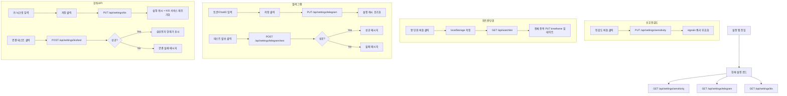

# 기능명세서 — 설정 (/settings)

**최종 업데이트**: 2026-03-19

## 사용자 흐름도



## 화면 구성

### 1. BUY/SELL 신호 민감도

| 항목 | 내용 |
|------|------|
| 위치 | 최상단 섹션 |
| 선택 방식 | 3개 라디오 카드 (엄격/보통/민감) |
| 현재 선택 | 테두리 + 배경색 강조 |

**프리셋 상세:**

| 레벨 | 라벨 | 필수 조건 | RSI | %B | Vol | 색상 |
|------|------|----------|-----|-----|-----|------|
| strict | 엄격 | 4/4 | <30 | ≤0.05 | >1.2x | 파랑 |
| normal | 보통 | 3/4 | <35 | ≤0.15 | >1.1x | 노랑 |
| sensitive | 민감 | 2/4 | <40 | ≤0.25 | >1.0x | 빨강 |

**동작:**
- 클릭 → `PUT /api/settings/sensitivity` → signals 쿼리 무효화
- 백엔드: `signal_engine.py`의 `save_sensitivity()` 호출 → 파일 저장
- 다음 스캔 시 변경된 민감도 적용

### 2. 차트 봉 단위

| 항목 | 내용 |
|------|------|
| 선택 방식 | 6개 버튼 |
| 저장 위치 | `localStorage('timeframe')` |
| 적용 범위 | 전체 관심종목 |

**옵션:**

| 값 | 라벨 | 설명 |
|----|------|------|
| 15m | 15분봉 | 단타/스캘핑용 |
| 30m | 30분봉 | 단기 트레이딩 |
| 1h | 1시간봉 | 단기 스윙 |
| 4h | 4시간봉 | 중기 스윙 |
| 1d | 일봉 | 중장기 투자 |
| 1w | 주봉 | 추세 추종 (기본값) |

**동작:**
1. localStorage에 timeframe 저장
2. `GET /api/watchlist` → 전체 종목 목록 조회
3. 각 종목에 `PUT /api/watchlist/{id}` → timeframe 업데이트
4. 완료 메시지 표시 (3초 후 사라짐)

### 3. 텔레그램 알림

| 항목 | 내용 |
|------|------|
| 아이콘 | MessageCircle (sky) |
| 설명 | "BUY/SELL 신호 전환 시 텔레그램으로 실시간 알림" |

**입력 필드:**

| 필드 | 타입 | placeholder | 도움말 |
|------|------|-------------|--------|
| Bot Token | text | 123456:ABC-DEF... | @BotFather에서 봇 생성 후 받은 토큰 |
| Chat ID | text | -1001234567890 | @userinfobot으로 확인 (그룹은 - 접두사) |

**버튼:**

| 버튼 | 조건 | 동작 |
|------|------|------|
| 저장 | 토큰+ChatID 입력 필수 | `PUT /api/settings/telegram` → 설정 캐시 초기화 |
| 테스트 발송 | 저장 완료 후 활성 | `POST /api/settings/telegram/test` |

**상태 표시:**
- 미설정: 입력 폼만 표시
- 설정됨: 토큰 마스킹 (`xxxxx***xxxx`) + 초록 "텔레그램 연동됨"
- 테스트 성공: 초록 메시지 (5초)
- 테스트 실패: 빨강 메시지 (3초)

### 4. 한국투자증권 API

| 항목 | 내용 |
|------|------|
| 아이콘 | TrendingUp (orange) |
| 설명 | "한국 주식 실시간 체결가를 초 단위로 수신 (미설정 시 pykrx fallback)" |

**입력 필드:**

| 필드 | 타입 | placeholder | 설명 |
|------|------|-------------|------|
| APP KEY | text | PSxxxxxxxx... | 36자리 앱키 |
| APP SECRET | password | 시크릿 키 입력 | 180자리 (마스킹) |
| 계좌번호 | text | 00000000-01 | 8자리-2자리 형식 |

**토글:**

| 항목 | 기본값 | 설명 |
|------|--------|------|
| 모의투자 모드 | ON | ON=모의투자 키, OFF=실전투자 키 |

**버튼:**

| 버튼 | 조건 | 동작 |
|------|------|------|
| 저장 | KEY+SECRET 필수 | `PUT /api/settings/kis` → 설정 캐시 + KIS 서비스 재초기화 |
| 연결 테스트 | 저장 완료 후 활성 | `POST /api/settings/kis/test` → 삼성전자(005930) 현재가 조회 |

**WebSocket 상태 표시:**

| 상태 | 표시 |
|------|------|
| 연결됨 | Wifi 아이콘 (초록) + "WebSocket 연결됨 — X/40 종목 구독 중" |
| 미연결 | WifiOff 아이콘 (회색) + "WebSocket 미연결" |

**상태 표시:**
- 미설정: 입력 폼만
- 설정됨: APP KEY 마스킹 + 초록 "한투 API 연동됨"
- 테스트 성공: "연결 성공! 삼성전자 현재가: XXX,XXX원"
- 테스트 실패: 빨강 에러 메시지

## API 엔드포인트

| Method | 경로 | 호출 시점 | 설명 |
|--------|------|----------|------|
| GET | `/api/settings/sensitivity` | 페이지 로드 | 현재 민감도 + 프리셋 목록 |
| PUT | `/api/settings/sensitivity` | 민감도 변경 | 레벨 업데이트 |
| GET | `/api/watchlist` | 봉 단위 변경 시 | 전체 종목 목록 |
| PUT | `/api/watchlist/{id}` | 봉 단위 변경 시 | 개별 종목 timeframe 업데이트 |
| GET | `/api/settings/telegram` | 페이지 로드 | 텔레그램 설정 상태 |
| PUT | `/api/settings/telegram` | 저장 클릭 | 토큰/ChatID 저장 |
| POST | `/api/settings/telegram/test` | 테스트 클릭 | 테스트 메시지 발송 |
| GET | `/api/settings/kis` | 페이지 로드 | KIS 설정 + WebSocket 상태 |
| PUT | `/api/settings/kis` | 저장 클릭 | KIS 키 저장 |
| POST | `/api/settings/kis/test` | 테스트 클릭 | 삼성전자 현재가 조회 |

## 백엔드 동작

### 민감도 변경 시
```
PUT /api/settings/sensitivity → save_sensitivity(level)
→ sensitivity.json 파일에 저장
→ 다음 스캔 시 SignalEngine이 새 설정으로 판정
```

### 텔레그램 저장 시
```
PUT /api/settings/telegram → .env 파일 업데이트
→ get_settings.cache_clear() → pydantic-settings 재로드
```

### KIS 저장 시
```
PUT /api/settings/kis → .env 파일 업데이트
→ get_settings.cache_clear() + reset_kis_service()
→ KIS 클라이언트 재초기화 (새 키로 토큰 발급)
```

## 레이아웃

| 항목 | 모바일 | PC |
|------|--------|-----|
| 컨테이너 | max-w-xl, p-6 | 동일 |
| 섹션 간격 | mt-6 | mt-6 (동일) |
| 입력 폼 | 전폭 | 전폭 |
| 버튼 | 2열 (저장 + 테스트) | 2열 (동일) |
