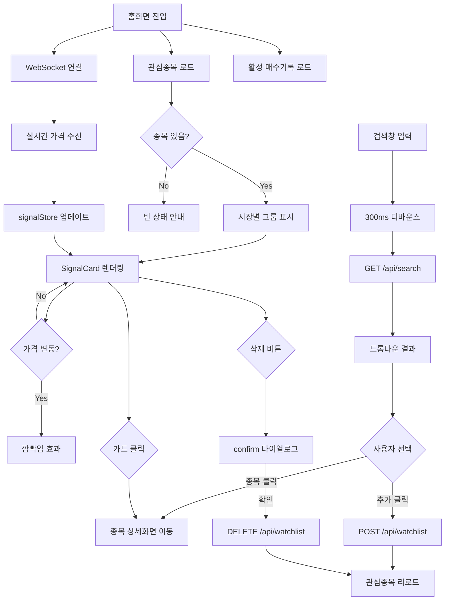
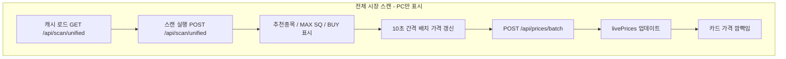

# 기능명세서 — 홈화면 (/)

**최종 업데이트**: 2026-03-19

## 사용자 흐름도





## 화면 구성

### 1. 스퀴즈 4단계 가이드 (접기/펼치기)

| 항목 | 내용 |
|------|------|
| 위치 | 페이지 최상단 |
| 기본 상태 | 접힘 (클릭하면 펼침) |
| 내용 | NO SQ / LOW SQ / MID SQ / MAX SQ 4단계 색상 범례 |
| 추가 설명 | RSI, %B, Vol 용어 설명 (펼침 시) |
| 모바일 | 2x2 그리드, 텍스트 13px |
| PC | 1x4 그리드, 텍스트 10px |

### 2. 종목 검색

| 항목 | 내용 |
|------|------|
| 위치 | 스퀴즈 가이드 아래 |
| 모바일 | sticky (상단 고정, z-30) |
| PC | static |
| 디바운스 | 300ms |
| API | `GET /api/search?q={query}` |
| 결과 표시 | z-50 오버레이 드롭다운 |
| 결과 항목 | 종목명 + 심볼 + 시장 배지 + "추가" 버튼 |
| 종목 클릭 | `/:symbol?market=XX` 상세화면 이동 |
| 추가 클릭 | `POST /api/watchlist` → 관심종목에 추가 |
| 외부 클릭 | 드롭다운 닫힘 |

### 3. 관심종목 목록

| 항목 | 내용 |
|------|------|
| 데이터 | `GET /api/signals` (React Query, 10초 리패치) |
| 그룹핑 | KR → US → CRYPTO 순서 |
| 시장 라벨 | "한국 주식 (2)" / "미국 주식 (1)" / "암호화폐 (2)" |
| 개장 상태 | KR: 09:00~15:30 평일 / US: 09:30~16:00 ET 평일 / CRYPTO: 24시간 |
| 개장 시 | 초록 펄스 "실시간 가격 반영중" |
| 폐장 시 | 회색 "장종료" |
| 레이아웃 | 모바일 1열 / PC 2열(md) / 3열(lg) |
| 모바일 | 카드 배경/보더 없음 (넓게 사용) |
| PC | `bg-card` + 보더 + 라운드 박스 |

### 4. SignalCard (종목 카드)

| 항목 | 모바일 | PC |
|------|--------|-----|
| 패딩 | 16px (p-4) | 10px (p-2.5) |
| 종목명 | 17px bold | 14px (sm) |
| 심볼 | 12px (xs) | 10px |
| 가격 | 20px (xl) bold | 14px (sm) |
| 등락률 | 13px semibold | 10px |
| 지표 (RSI/%B/Vol) | 13px semibold | 9px |
| 추세 배지 | 11px | 9px |
| 스퀴즈 도트 | 10px | 8px |

**배지 종류:**
- `매수중` (시안) — 활성 매수 기록 있는 종목
- `상승추세` (초록) — EMA 20 > 50 > 200
- `하락추세` (빨강) — EMA 20 < 50 < 200
- `NO SQ`~`MAX SQ` (초록~빨강) — 스퀴즈 레벨

**가격 깜빡임:**
- 상승: 초록 + animate-pulse (0.8초)
- 하락: 빨강 + animate-pulse (0.8초)

**삭제:**
- PC: 호버 시 우상단 빨간 휴지통 아이콘 표시
- 클릭 → `confirm()` → `DELETE /api/watchlist/{id}`

### 5. 전체 시장 스캔 (PC만 표시)

| 항목 | 내용 |
|------|------|
| 표시 조건 | `hidden md:block` (모바일 숨김) |
| 자동 실행 | 페이지 로드 시 캐시 로드 + 새 스캔 실행 |
| 새로고침 | "새로고침" 버튼 → `POST /api/scan/unified` |
| 소요 시간 | 약 30초~1분 (159개 종목 다운로드) |

**하위 섹션:**

| 섹션 | 조건 | 정렬 | 제한 |
|------|------|------|------|
| 추천 종목 | MID/MAX SQ + 상승추세 + 데드크로스 제외 | 스퀴즈 + 강도순 | 시장별 Top 3 |
| MAX SQ 폭발 임박 | MAX SQ + 상승추세 + 데드크로스 제외 | 스퀴즈 + 강도순 | 시장별 Top 5 |
| 차트 BUY 신호 | 일봉 3일 이내 BUY + 데드크로스 제외 | 상승추세 우선 | 한국 2 + 미국 1 |

**실시간 가격 갱신:**
- 10초 간격 `POST /api/prices/batch`
- CRYPTO 제외 (한투 API 미지원)
- 가격 변동 시 카드 깜빡임 효과
- 각 섹션 제목 옆 "실시간 가격 반영중" 라벨

## API 엔드포인트

| Method | 경로 | 호출 시점 | 설명 |
|--------|------|----------|------|
| GET | `/api/signals` | 페이지 로드 | 관심종목 신호 목록 |
| GET | `/api/search?q=` | 검색 입력 (300ms) | 종목 검색 |
| POST | `/api/watchlist` | 추가 클릭 | 관심종목 등록 |
| DELETE | `/api/watchlist/{id}` | 삭제 확인 | 관심종목 삭제 |
| GET | `/api/scan/unified` | 페이지 로드 | 스캔 캐시 로드 |
| POST | `/api/scan/unified` | 페이지 로드 + 새로고침 | 전체 시장 스캔 |
| POST | `/api/prices/batch` | 10초 간격 | 배치 가격 조회 |
| GET | `/api/trades?status=ACTIVE` | 페이지 로드 | 활성 매수 기록 |
| WebSocket | `/ws` | 자동 연결 | 실시간 가격/신호 |

## 실시간 데이터 흐름

```
WebSocket /ws
  ├─ signal_update → signalStore.updateSignal() → SignalCard 리렌더
  └─ price_update → signalStore.updatePrices() → SignalCard 가격 깜빡임

배치 가격 (스캔 섹션):
  setInterval(10초) → POST /api/prices/batch → livePrices state → PickCard/BuyCard 깜빡임
```
