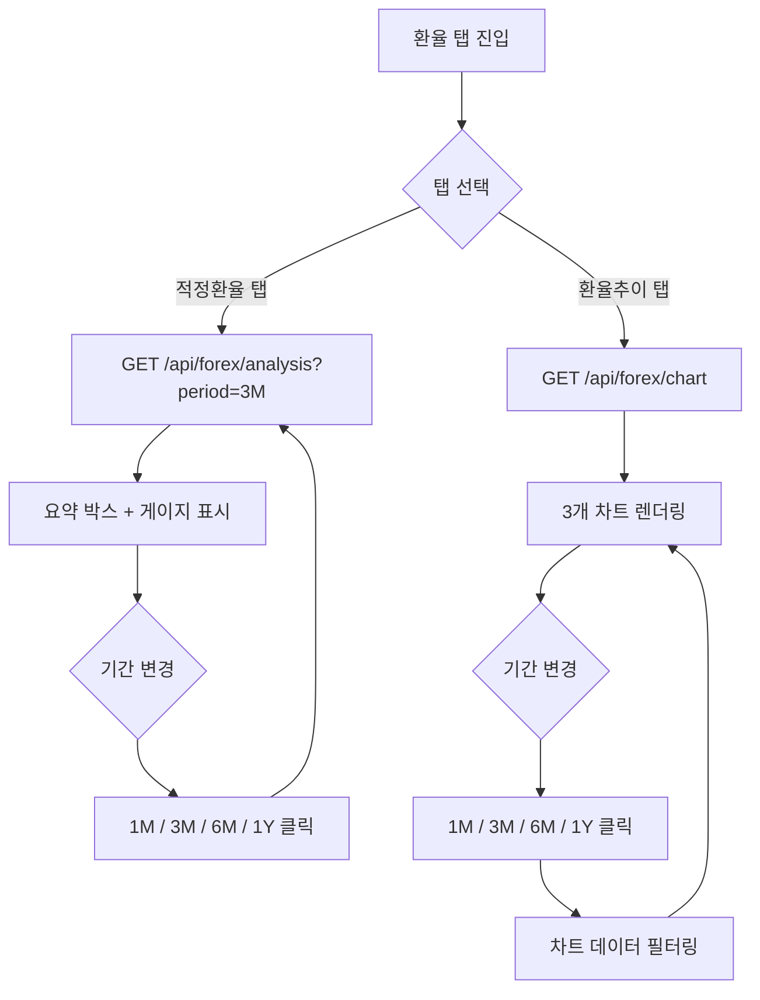

# 기능명세서 — 환율 (/forex)

**최종 업데이트**: 2026-03-19

## 사용자 흐름도

## 화면 구성

### 탭 구조

| 탭 | 경로 | 기본 선택 |
|-----|------|---------|
| 적정환율 | analysis | 기본값 |
| 환율추이 | chart | 클릭 시 |

---

### 탭 1: 적정환율 (Analysis)

#### 1-1. 요약 박스 (3열 그리드)

| 항목 | 표시 형식 | 색상 |
|------|----------|------|
| 달러 지수 (DXY) | 소수점 2자리 | 흰색 |
| 52주 달러 갭 | ±X.XX% | 초록(+) / 빨강(-) |
| 적정 환율 | 정수 (원) | 흰색 |

#### 1-2. 다음 매수 적정가

| 항목 | 내용 |
|------|------|
| 현재 환율 | 정수 (원) |
| 적정 매수가 | 정수 (원) + 현재 대비 갭% |
| 갭 색상 | 할인(초록) / 프리미엄(빨강) |
| 매수 판단 | 초록 배경 "매수 적기" or 빨강 "매수 대기" |

#### 1-3. 판정 (Verdict)

| 항목 | 내용 |
|------|------|
| 상태 | BUY / SELL / NEUTRAL |
| 점수 | X/4 (4개 조건 충족 수) |
| 배경색 | 초록(BUY) / 빨강(SELL) / 회색(NEUTRAL) |

#### 1-4. 4개 게이지 바

| 게이지 | 범위 | 설명 |
|--------|------|------|
| USDKRW 현재 | lower ~ upper | 현재 원/달러 위치 |
| 달러 지수 (DXY) | lower ~ upper | DXY 위치 |
| 52주 갭 | lower ~ upper | 달러 갭 % |
| 적정환율 대비 | lower ~ upper | 현재 vs 적정 |

게이지 구성:
- 그라디언트 바 (초록 → 회색 → 빨강)
- 현재값 도트 (색상: 매수=초록, 매도=빨강, 중립=파랑)
- 하단: 하한/적정/상한 라벨

#### 1-5. 기간 선택

| 기간 | 값 | 설명 |
|------|-----|------|
| 1개월 | 1M | 단기 |
| 3개월 | 3M | 기본값 |
| 6개월 | 6M | 중기 |
| 1년 | 1Y | 장기 |

---

### 탭 2: 환율추이 (Chart)

#### 2-1. 추세 판단 카드 (2열)

| 항목 | USDKRW | DXY |
|------|--------|-----|
| 현재값 | 정수/소수 2자리 | 소수 2자리 |
| MA20 | 20일 이동평균 | 20일 이동평균 |
| 평균 | 기간 평균 | 기간 평균 |
| 해석 | "단기 상승세, 평균 위" 등 | 동일 |

추세 판단 로직:
- 현재 > MA20 > 평균 → "단기 상승세, 평균 위"
- 현재 < MA20 < 평균 → "단기 하락세, 평균 아래"
- 그 외 → "횡보"

#### 2-2. 3개 차트 (lightweight-charts LineSeries)

| 차트 | 데이터 | 라인 |
|------|--------|------|
| USDKRW | 원/달러 환율 | 메인(흰색) + 적정선(초록) + 상하단 밴드(빨강 점선) |
| DXY | 달러 지수 | 메인(시안) + MA20(주황) + 평균선(회색) |
| 복합 | USDKRW + DXY | 좌축: USDKRW(빨강), 우축: DXY(파랑) |

차트 옵션:
- 배경: #1e293b
- 텍스트: #94a3b8
- 높이: 220px
- timeVisible: true
- crosshair 동기화 없음 (독립)

#### 2-3. 기간별 통계 카드 (3열)

| 통계 | 내용 |
|------|------|
| 현재가 | 마지막 종가 |
| 기간 변동률 | (현재 - 시작) / 시작 × 100% |
| 최고/최저 | 기간 내 고/저 |
| 평균 | 기간 내 평균 |
| 상관계수 | KRW-DXY 상관관계 (-1 ~ +1) |

#### 2-4. 기간 필터링

| 기간 | 영업일 수 | 용도 |
|------|----------|------|
| 1M | 22일 | 단기 분석 |
| 3M | 66일 | 기본값 |
| 6M | 132일 | 중기 분석 |
| 1Y | 252일 | 장기 분석 |

데이터는 API에서 전체를 받아 프론트에서 기간별 필터링 (`.slice(-days)`)

## API 엔드포인트

| Method | 경로 | 호출 시점 | 파라미터 | 응답 주요 필드 |
|--------|------|----------|---------|--------------|
| GET | `/api/forex/analysis` | 적정환율 탭 + 기간 변경 | `?period=3M` | dxy, dollar_gap_52w, fair_value, next_buy_price, usdkrw, verdict, verdict_score, gauge_krw/dxy/gap/fair |
| GET | `/api/forex/chart` | 환율추이 탭 (1회) | - | krw[], dxy[], fair_line[], upper_line[], lower_line[] |

## 레이아웃

| 항목 | 모바일 | PC |
|------|--------|-----|
| 컨테이너 | max-w-4xl, p-6 | 동일 |
| 요약 박스 | grid-cols-3 | grid-cols-3 (동일) |
| 추세 카드 | grid-cols-2 | grid-cols-2 (동일) |
| 통계 카드 | grid-cols-3 | grid-cols-3 (동일) |
| 차트 | 전폭, 220px | 전폭, 220px |
