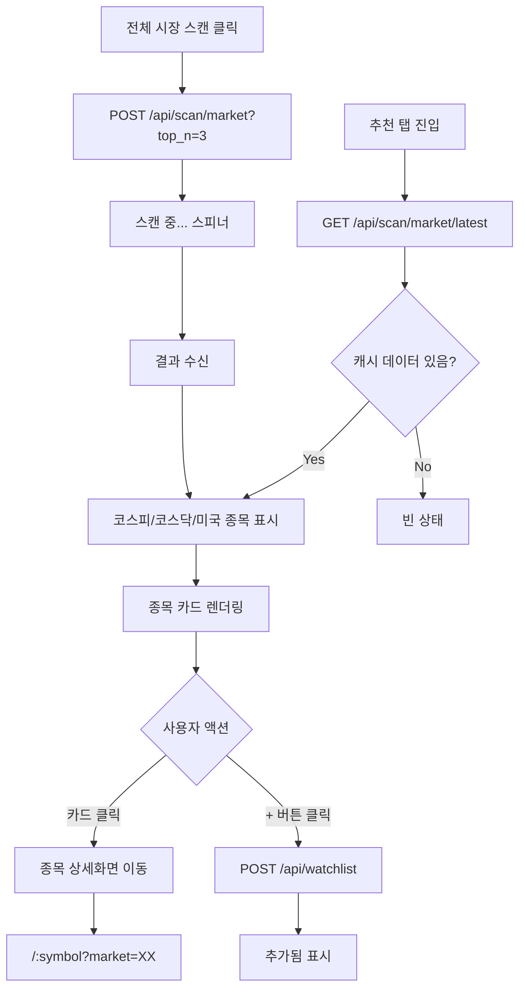

# 기능명세서 — 추천 (/picks)

**최종 업데이트**: 2026-03-19

## 사용자 흐름도

## 화면 구성

### 1. 헤더

| 항목 | 내용 |
|------|------|
| 제목 | "추천 종목" + TrendingUp 아이콘 (orange) |
| 스캔 버튼 | "전체 시장 스캔" (orange 배경, 로딩 시 스피너) |
| 스캔 상태 | "스캔 중 코스피..." → "스캔 완료" |
| 스캔일 | "스캔일: YYYY-MM-DD" (우상단) |

### 2. 시장별 종목 카드

| 시장 | 데이터 소스 | 최대 종목 수 |
|------|-----------|------------|
| 코스피 | `_get_kr_stocks("KOSPI")` — 54개 종목 스캔 | Top 3 |
| 코스닥 | `_get_kr_stocks("KOSDAQ")` — 30개 종목 스캔 | Top 3 |
| 미국 | `_get_us_stocks()` — 65개 종목 스캔 | Top 3 |

**스캔 조건:**
- MID SQ(2) 이상 + 상승추세(BULL)
- 데드크로스(EMA 20 < EMA 50) 제외
- 스퀴즈 레벨 + confidence 점수 내림차순

### 3. 종목 카드 필드

| 필드 | 표시 형식 | 설명 |
|------|----------|------|
| 순위 | #1, #2, #3 배지 | 강도순 |
| 종목명 | 볼드 텍스트 | display_name |
| 심볼 | 회색 코드 | 005930, AAPL 등 |
| 가격 | 한국: 정수 / 미국: 소수점 2자리 | 현재가 |
| 등락률 | +초록 / -빨강 | change_pct |
| 추세 | "상승추세" 초록 배지 | trend === 'BULL' |
| 스퀴즈 | 색상 도트 + 라벨 | NO SQ ~ MAX SQ |
| RSI | 숫자 (30 이하 초록, 70 이상 빨강) | RSI(14) |
| %B | 퍼센트 | 볼린저 밴드 위치 |
| Vol | 배율 (1.2x) | 평균 대비 거래량 |
| + 버튼 | Plus 아이콘 | 관심종목 추가 |

### 4. 관심종목 추가

| 항목 | 내용 |
|------|------|
| 트리거 | + 아이콘 클릭 |
| API | `POST /api/watchlist` |
| market 추론 | KOSPI/KOSDAQ → "KR", 그 외 → "US" |
| timeframe | "1d" 고정 |
| 성공 시 | 버튼 → "추가됨" 텍스트 + 쿼리 무효화 |
| 중복 시 | 에러 무시 (catch 비어있음) |

## API 엔드포인트

| Method | 경로 | 호출 시점 | 설명 |
|--------|------|----------|------|
| GET | `/api/scan/market/latest` | 페이지 로드 | DB에서 최신 스캔 결과 조회 |
| POST | `/api/scan/market?top_n=3` | 스캔 버튼 클릭 | 전체 시장 스캔 (코스피→코스닥→미국 순차) |
| POST | `/api/watchlist` | + 버튼 클릭 | 관심종목 추가 |

## 홈화면 스캔과의 차이

| 항목 | 추천 탭 (/picks) | 홈화면 스캔 (/) |
|------|-----------------|----------------|
| API | `/api/scan/market` | `/api/scan/unified` |
| 결과 | 추천 종목만 | 추천 + MAX SQ + BUY 3가지 |
| 실시간 가격 | 없음 | 10초 간격 배치 갱신 |
| 저장 | DB `daily_top_pick` 테이블 | 메모리 캐시 |
| 가격 깜빡임 | 없음 | 있음 |

## 레이아웃

| 항목 | 모바일 | PC |
|------|--------|-----|
| 카드 그리드 | 1열 | 3열 (md:grid-cols-3) |
| 패딩 | p-6 | p-6 (동일) |
| 카드 상세 | 3열 그리드 (RSI/%B/Vol) | 3열 그리드 |
